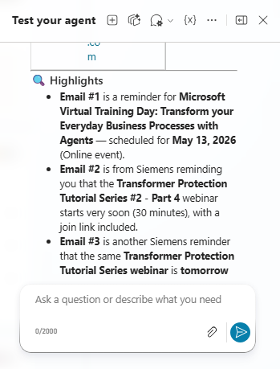

# Email & Calendar Events Agent

---

## Overview
The Email & Calendar Events Agent is an intelligent automation solution built using Microsoft Copilot Studio.

It connects email and calendar workflows by automatically extracting meeting details from emails and creating calendar events.

---

## Problem
Professionals receive many emails with meeting details. Manually creating calendar events leads to:
- Missed meetings
- Duplicate events
- Lost time

---

## Solution
This agent:
- Monitors inbox for new emails
- Extracts event information
- Creates calendar events automatically
- Prevents duplicates
- Manages email + calendar workflows

---

## Features
- 📩 Search and retrieve emails (new & existing)
- ✉️ Draft and edit emails
- ❌ Delete emails
- 📅 Create calendar events
- 🔁 Detect duplicate events
- ⚡ Trigger-based automation

---

## Architecture

See full architecture: [architecture.md](./architecture.md)

---

## Agent Instructions
See full instructions: [agent-instructions.md](./agent-instructions.md)

---

## Technologies
- Microsoft Copilot Studio
- Claude Sonnet 4.6
- MCP Servers (Email + Meeting Management)
- Power Platform Connectors

---

## Agent Capabilities
- Email parsing and analysis
- Event extraction (title, time, link)
- Calendar management (create/update/delete)
- Intelligent decision-making

---

## Demo
https://youtu.be/Au-E04zcU2g

---

## 📸 Screenshots

### 🔹 Agent Overview Screen

---

### 🔹 Agent Overview Screen (View 2)

---

### 🔹 Agent Trigger Configuration

---

### 🔹 Agent Tools

---

### 🔹 Email Management MCP Server Configuration

---

### 🔹 Meeting Management MCP Server Configuration

---

### 🔹 Delete Calendar Events Connector Configuration

---

### 🔹 Agent Test Screen

---

### 🔹 Agent Test Screen (View 2)

---

### 🔹 Deployment Channels

---

### 🔹 Agent in Microsoft 365 Copilot

---

### 🔹 Agent in Microsoft 365 Copilot (View 2)

---

## Status
- Working prototype  
- Ready for future improvements

---

## Author
Vasyl Martyshko
