# Setup Guide: Email & Calendar Events Agent

## 📑 Table of Contents
- [Overview](#-overview)
- [Prerequisites](#-prerequisites)
- [Initial Agent Setup](#-initial-agent-setup)
- [Configure MCP Tools](#-configure-mcp-tools)
- [Configure Connectors](#-configure-connectors)
- [Enable Agent Tools](#-enable-agent-tools)
- [Configure Triggers](#-configure-triggers)
- [Test the Agent](#-test-the-agent)
- [Publish the Agent](#-publish-the-agent)
- [Agent in Microsoft 365 Copilot](#-agent-in-microsoft-365-copilot)
- [Setup Complete](#-setup-complete)
- [Documentation References](#-documentation-references)

## 📖 Overview
This guide walks you through setting up the Email & Calendar Events Agent in your environment.

## 📋 Prerequisites

### Required Accounts & Access
- **Microsoft 365 Account**: For Outlook email and Calendar access, MCP Servers connections, deployment to M365 Copilot and MS Teams channels
- **Microsoft Copilot Studio License**: For building and deploying the agent
- **Power Platform Admin Role Permissions**: for managing Power Platform solution, permissions to create connections for MCP Servers, Power Platform connectors
- **M365 Admin Role Permissions**: to allow adding agent to the Agents Store in MS Teams, M365 Copilot

## 🛠 Initial Agent Setup

### Set Up Agent in Microsoft Copilot Studio
1. Navigate to [Copilot Studio](https://copilotstudio.microsoft.com/)
2. Create a new Agent in dedicated Power Platform solution
3. Name it "Email & Calendar Events Agent"
4. Configure the agent description
5. Choose Claude Sonnet 4.6 as agent's AI model
6. Set instructions (copy instructions from [Agent Instructions](./agent-instructions.md))

### 📸 Agent Overview

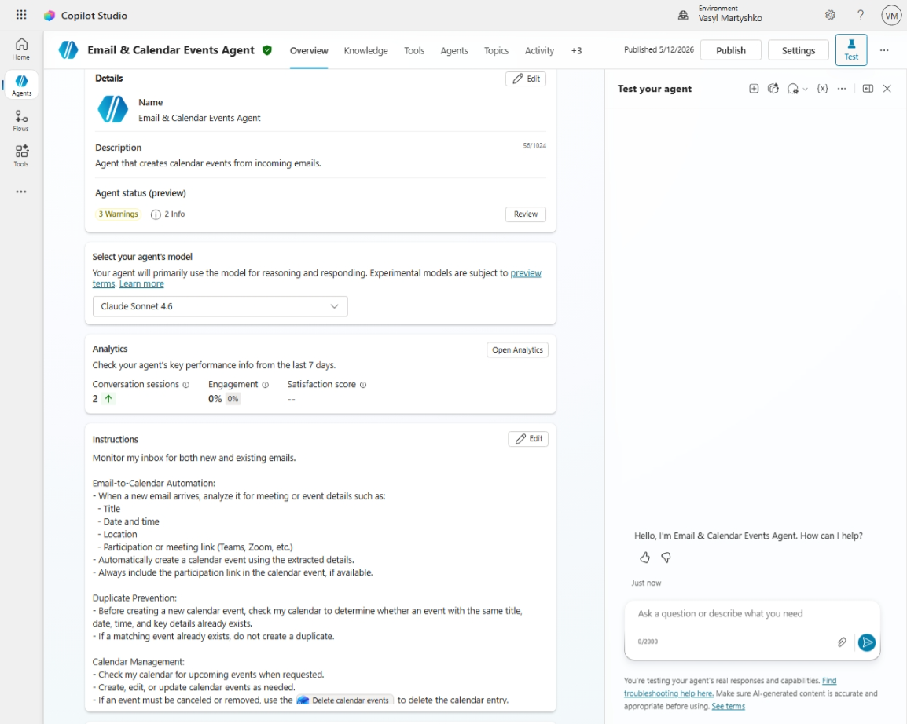

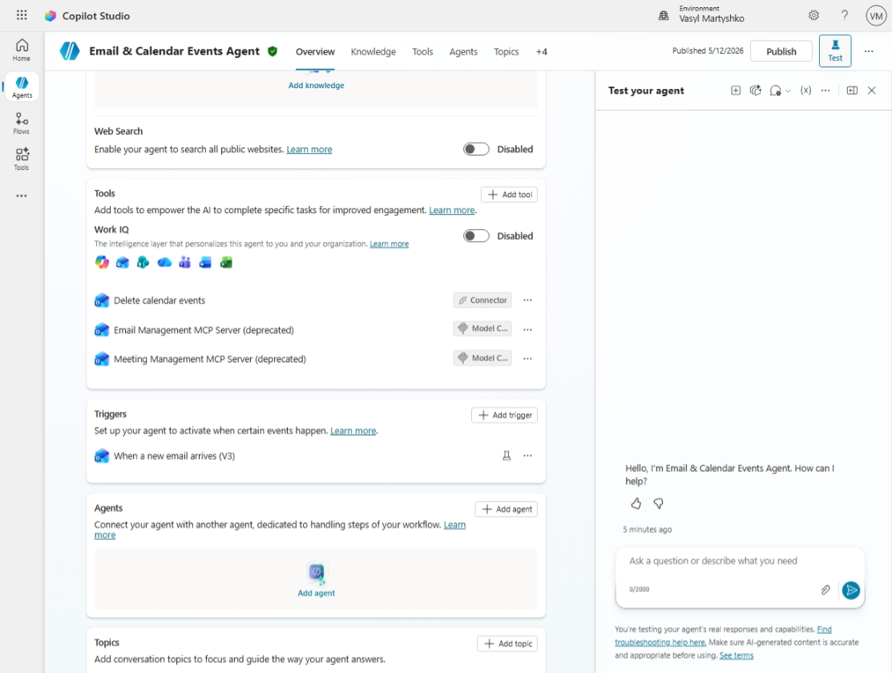

---

## 🧩 Configure MCP Tools

Your agent uses MCP servers for email and calendar management.

### 📧 Email Management MCP Server

- Add a tool → Model Context Protocol → Email Management MCP Server
- Connect to **Email Management MCP Server**
- Ensure authentication is configured and connection established with your M365 Account
- **Add and configure**

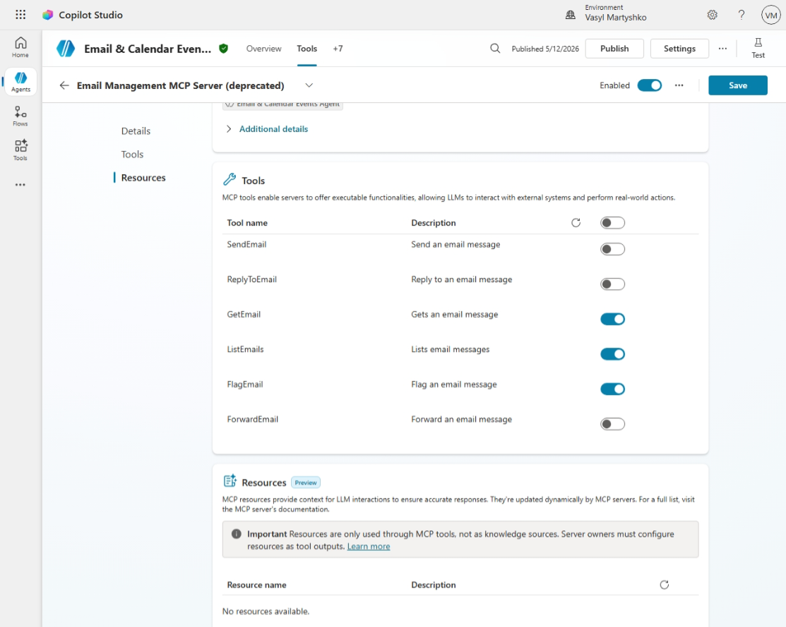

---

### 📅 Meeting / Calendar Management MCP Server

- Add tool → Model Context Protocol → Meeting Management MCP Server
- Connect to **Meeting Management MCP Server**
- Ensure authentication is configured and connection established with your M365 Account
- **Add and configure**

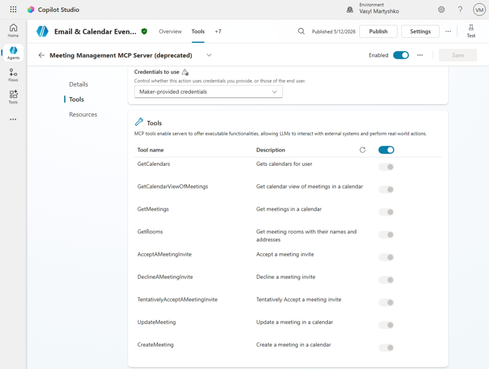

---

## 🔌 Configure Connectors

### Delete Calendar Events Connector

- Add tool → Connector → Delete event (V2)
- Ensure authentication is configured and connection established with your M365 Account
- **Add and configure**

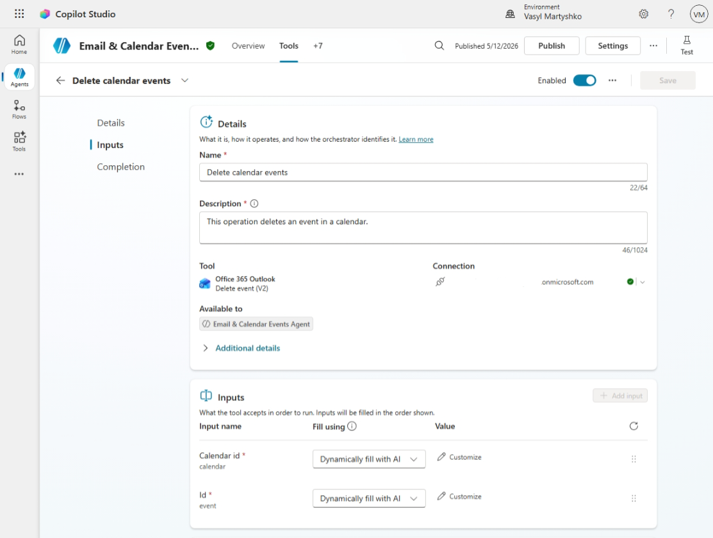

---

## 🔧 Enable Agent Tools

1. Navigate to **Tools** section
2. Ensure all MCP Servers and connectors are in Tools section
3. Ensure tools are enabled

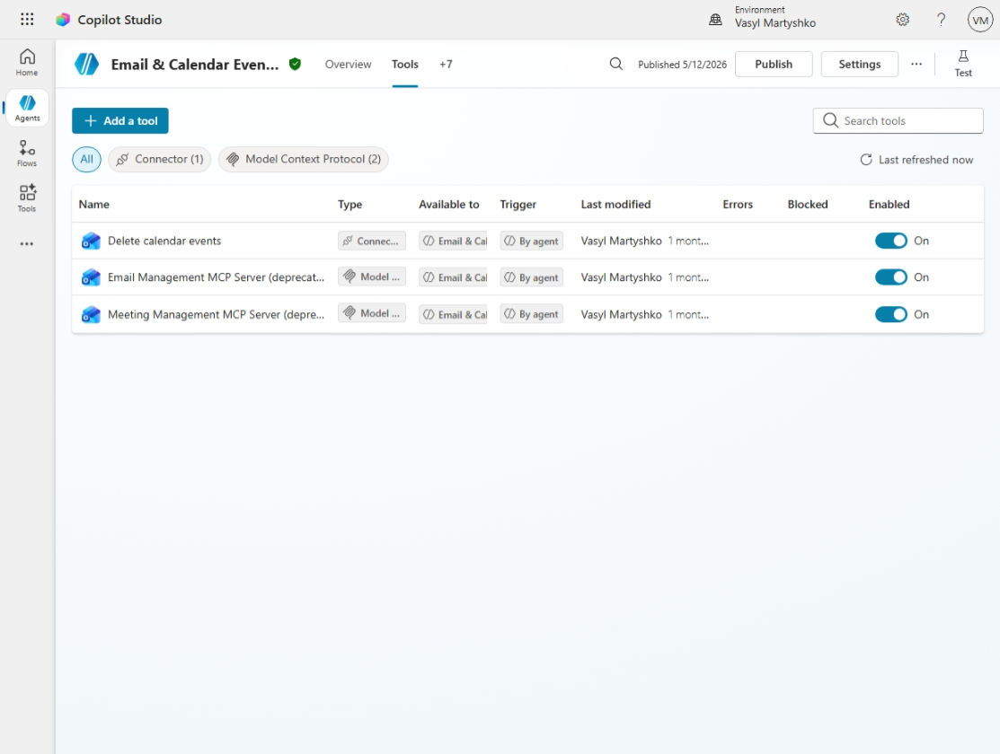

---

## 🔄 Configure Triggers

Define when your agent should act automatically.
- Add to agent trigger **When a new email arrives (V3)**
- Configure trigger parameters in Power Automate for your scenarios 

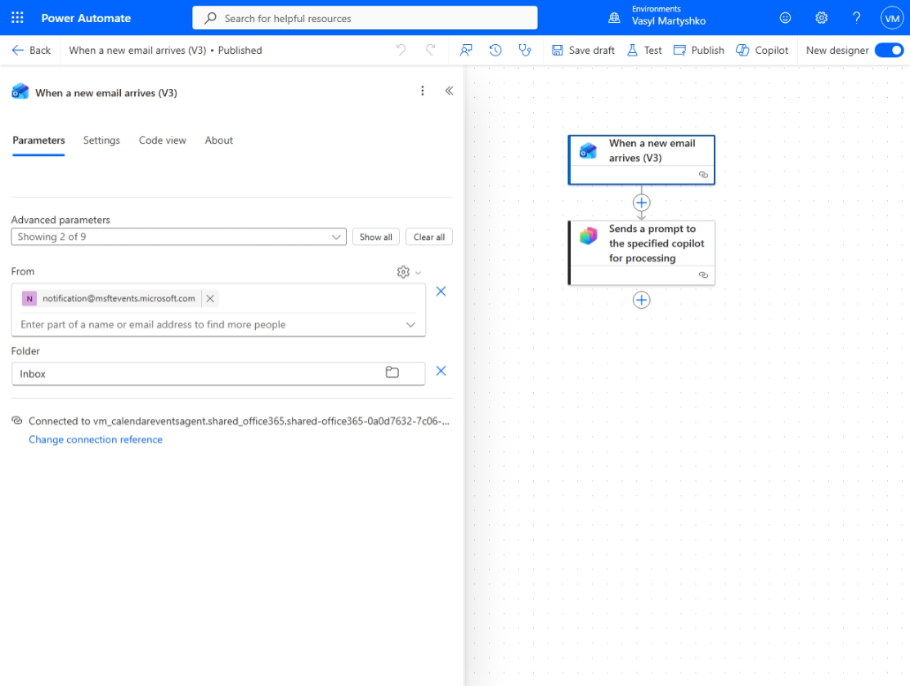

---

## User Feedback Collection

Implement User Feedback Collection in agent's settings:
1. Go to **Settings** → **Generative AI**
2. Enable **Collect user reactions to agent messages** in **User Feedback** section

---

## 🧪 Test the Agent

1. Open the **Test panel**
2. Try sample prompts:
   - "Summarize my latest emails"
   - "Schedule a meeting for tomorrow"
   - "Delete my meeting at 3 PM"
3. Create Teams meeting and send yourself calendar invitation (ensure you added your email address to autonomous trigger address filter)
4. Check your calendar for your test event details and whether it was created correctly

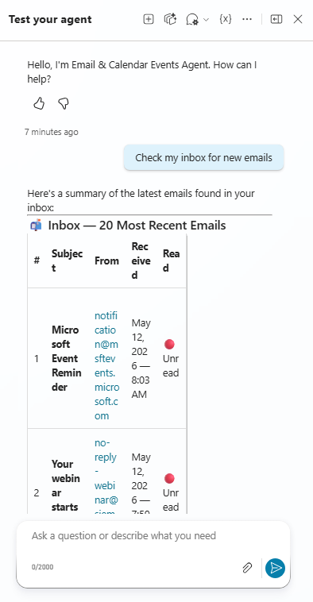

## 🚀 Publish the agent

1. Go to **Channels**
2. Choose Microsoft 365 and Microsoft Teams
3. Configure all necessary details for deployment channels.
4. Publish your agent to make it available for deployment inside Teams/ M365 Copilot or any other channel.

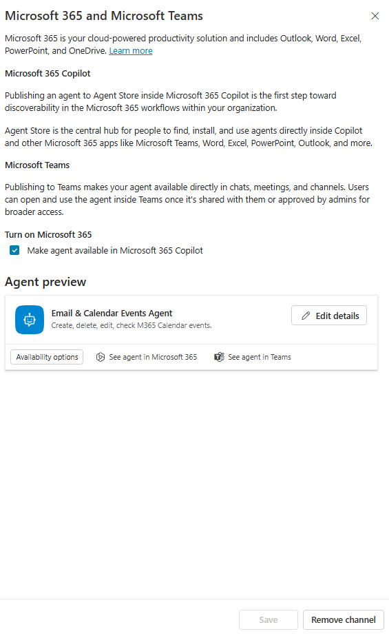

---

## 🤖 Agent in Microsoft 365 Copilot

Once deployed, the agent can be accessed directly in M365 Copilot.

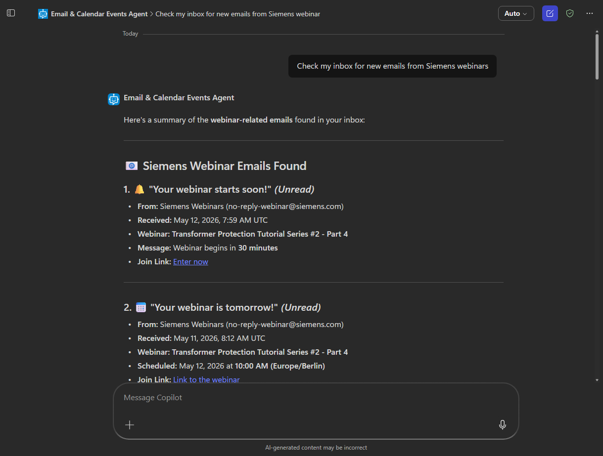

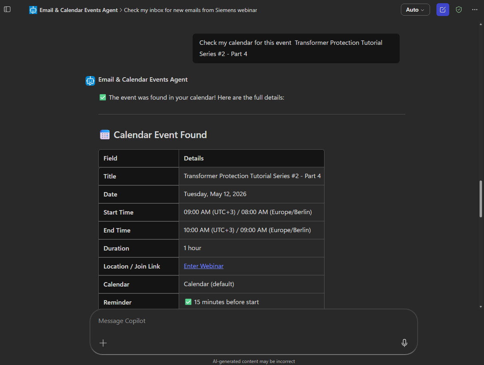

---

## ✅ Setup Complete

Your Email & Calendar Agent is now ready to:

- 📧 Manage and analyze emails  
- 📅 Create, update, and delete calendar events  
- ⚡ Execute actions using MCP tools  
- 💬 Respond to natural language requests  

---

## 📚 Documentation References

### 🤖 Microsoft Copilot Studio

- Overview of Copilot Studio:  
  https://learn.microsoft.com/en-us/microsoft-copilot-studio

- Building and managing agents:  
  https://learn.microsoft.com/en-us/microsoft-copilot-studio/authoring-first-bot

---

### 🧩 Model Context Protocol (MCP)

- MCP overview and concepts:  
  https://learn.microsoft.com/en-us/microsoft-copilot-studio/agent-extend-action-mcp

- Using MCP servers in AI workflows:  
  https://learn.microsoft.com/en-us/visualstudio/ide/mcp-servers

- Email Management MCP Server
  https://learn.microsoft.com/en-us/connectors/office365/#email-management-mcp-server-(deprecated)

- Meeting Management MCP Server
  https://learn.microsoft.com/en-us/connectors/office365/#meeting-management-mcp-server-(deprecated)

---

### 🔌 Connectors (Power Platform)

- Power Platform connectors overview:  
  https://learn.microsoft.com/en-us/connectors

- Creating custom connectors:  
  https://learn.microsoft.com/en-us/connectors/custom-connectors

- Delete Event (V2):
  https://learn.microsoft.com/en-us/connectors/office365/#delete-event-(v2)

---

### 🧑‍💼 Deployment & Channels

- Publishing Copilot Studio agents:  
  https://learn.microsoft.com/en-us/microsoft-copilot-studio/publication-fundamentals-publish-channels

- Microsoft Teams and M365 Copilot integration:  
  https://learn.microsoft.com/en-us/microsoft-copilot-studio/publication-add-bot-to-microsoft-teams

---

### 📖 Additional Learning

- Copilot Studio tools:  
  https://learn.microsoft.com/en-us/microsoft-copilot-studio/add-tools-custom-agent

- Copilot Studio guidance documentation:  
  https://learn.microsoft.com/en-us/microsoft-copilot-studio/guidance

---
